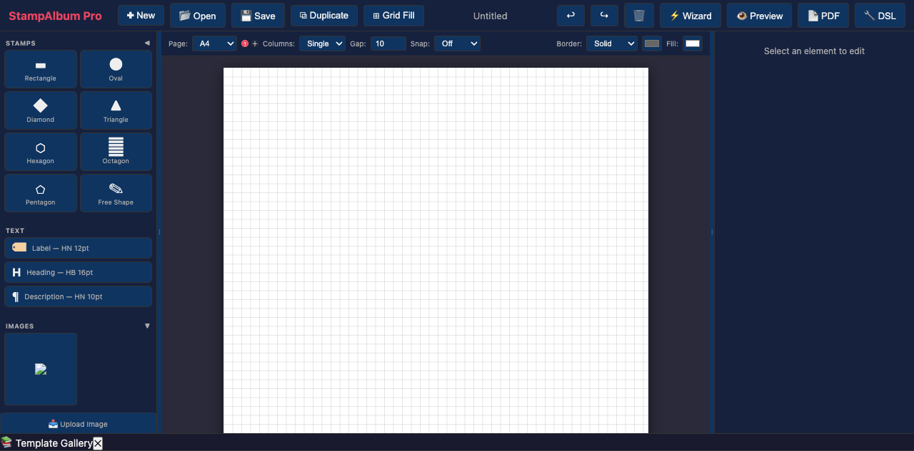
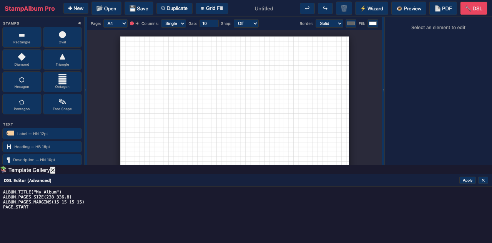

# StampAlbum Pro

A modern stamp album typesetter with live preview, a web-based editor, and advanced typography.

## Overview

StampAlbum Pro is a web application for creating professional stamp album pages for display and competition use. It generates high-quality PDF output from a declarative text-based configuration format, with a live preview that updates as you type.

## Features

- **Web-based editor**: Visual canvas with drag-and-drop, SVG shapes, and live preview
- **Live preview**: Auto-renders HTML preview as you design
- **File management**: Create, open, save, and delete `.slbum` album files from the browser sidebar
- **PDF export**: One-click PDF generation and download
- **Visual canvas**: Free-form stamp positioning with drag, resize, and alignment guides
- **Stamp shapes**: Rectangle, triangle, diamond, oval, hexagon, octagon, pentagon
- **Text elements**: Labels, headings, and descriptions with inline editing
- **Grid fill**: Duplicate stamps in a grid pattern
- **Undo/redo**: Full history with Ctrl+Z / Ctrl+Y
- **Templates**: Pre-built album templates by country and era
- **Quick Setup Wizard**: Create a new album with page size, border, and template selection
- **Image support**: Upload and place images on album pages
- **Responsive layout**: Works on desktop and tablet browsers

## Installation

### Option 1: Install from PyPI (recommended)

```bash
pip install stamp-album-pro
stamp-album
```

### Option 2: Install from source

```bash
# Clone the repository
git clone https://github.com/jsganesh/stamp-album-pro.git
cd stamp-album-pro

# Create virtual environment
python -m venv venv
source venv/bin/activate  # On Windows: venv\Scripts\activate

# Install dependencies
pip install -e ".[dev]"
```

### Legacy Desktop Editor (optional)

The legacy PyQt6 desktop editor is optional. Install it with:

```bash
pip install -e ".[legacy]"
```

### macOS Native Dependencies

None! StampAlbum Pro uses PyMuPDF for PDF generation — no native libraries (Pango, Cairo, GLib) required.

## Quick Start

### Run the app (recommended — works on Windows, macOS, Linux)

```bash
stamp-album
```

This opens StampAlbum Pro in your **default web browser** — cross-platform,
no installation needed beyond the `pip install`. Exports download to your
Downloads folder.

Alternative commands:

```bash
stamp-album --browser    # open in your default web browser instead
stamp-album-web          # same as --browser
stamp-album-browser      # same as --browser
stamp-album --legacy-qt  # legacy PyQt6 editor (requires: pip install ".[legacy]")
```

Environment overrides:

```bash
STAMP_ALBUM_PORT=9000 stamp-album       # use a specific port
STAMP_ALBUM_NO_BROWSER=1 stamp-album    # start server without opening a browser
STAMP_ALBUM_RELOAD=1 stamp-album        # auto-reload on code changes (development)
```

### Run directly from source

```bash
python -m stamp_album            # desktop window (default)
python -m stamp_album --browser  # browser mode
python -m stamp_album.serve      # browser mode (explicit)
python -m stamp_album.api        # server only, then open http://localhost:8080
```

### Command Line

```bash
# Generate a PDF from an album file
python -m stamp_album -c examples/sample.txt -o output.pdf

# Generate with HTML preview
python -m stamp_album -c examples/sample.txt -p
```

### Desktop App (macOS / Windows / Linux)

```bash
# Build the desktop binary with PyInstaller
pip install pyinstaller
pyinstaller stamp-album.spec

# Run the app
# macOS:
open "dist/StampAlbum Pro.app"
# Windows: dist\StampAlbumPro\StampAlbumPro.exe
# Linux: ./dist/StampAlbumPro/StampAlbumPro
```

## Web App Screenshots



*The main editor: drag-and-drop stamp palette (left), visual canvas (center), properties panel (right), and Quick Setup Wizard (bottom).*



*DSL editor panel for advanced users — direct text-based album definition with apply/close controls.*

The web interface features:

| Component | Description |
|-----------|-------------|
| **Toolbar** | New, Open, Save, Export PDF with keyboard shortcuts |
| **Canvas** | Visual drag-and-drop page layout with grid snap |
| **Sidebar** | Stamp palette, text tools, image manager, file browser |
| **Properties** | Position, size, border, fill, font for selected element |
| **Wizard** | Quick Setup with page size, border, template selection |
| **DSL Panel** | Advanced text-based album definition (toggle) |

## DSL Syntax

### Basic Album Structure

```
# Document metadata
ALBUM_TITLE ("My Album")
ALBUM_AUTHOR ("Author Name")

# Page setup
ALBUM_PAGES_SIZE (210.0 297.0)          # A4 size in mm
ALBUM_PAGES_MARGINS (20.0 15.0 15.0 15.0)  # left, right, top, bottom
ALBUM_PAGES_BORDER (0.1 0.5 0.1 1.0)    # triple line border
ALBUM_PAGES_SPACING (6.0 6.0)           # horizontal, vertical spacing

# Page title
ALBUM_PAGES_TITLE (TB 16 "Album Title")

# Define pages
PAGE_START

PAGE_TEXT_CENTRE (HS 12 "Section Heading")

ROW_START_FS (HN 8 0.5 6.0)             # font, size, spacing, width
STAMP_ADD (32.0 37.0 "Description" "sg 1" "" "sacc 1")
STAMP_ADD (32.0 37.0 "Description" "sg 2" "" "sacc 2")
```

### Commands

| Command | Description |
|---------|-------------|
| `ALBUM_TITLE` | Set album title |
| `ALBUM_PAGES_SIZE` | Set page dimensions (mm) |
| `ALBUM_PAGES_MARGINS` | Set page margins (mm) |
| `ALBUM_PAGES_BORDER` | Set line border |
| `ALBUM_PAGES_TITLE` | Set page title |
| `PAGE_START` | Begin a new page |
| `PAGE_TEXT` | Add left-aligned text |
| `PAGE_TEXT_CENTRE` | Add centered text |
| `PAGE_TEXT_RIGHT` | Add right-aligned text |
| `PAGE_RULE_H` | Add horizontal rule |
| `ROW_START_FS` | Start fixed-space row |
| `ROW_START_ES` | Start equal-space row |
| `ROW_START_JS` | Start justified-space row |
| `STAMP_ADD` | Add rectangular stamp |
| `STAMP_ADD_TRIANGLE` | Add triangle stamp |
| `STAMP_ADD_DIAMOND` | Add diamond stamp |
| `STAMP_ADD_OVAL` | Add oval stamp |
| `STAMP_HEADING` | Add heading to stamp |
| `COLOUR_*` | Set element colors |

### Font Identifiers

| ID | Font |
|----|------|
| CN, CB, CI, CS | Courier variants |
| TN, TB, TI, TS | Times variants |
| HN, HB, HI, HS | Helvetica variants |

Define custom fonts with `ALBUM_DEFINE_FONT (ID "Font Name")`.

## API Reference

The FastAPI server provides these endpoints:

| Method | Endpoint | Description |
|--------|----------|-------------|
| `GET` | `/` | Web application |
| `GET` | `/docs` | Interactive API documentation (Swagger UI) |
| `GET` | `/files` | List all `.slbum` files |
| `GET` | `/files/{name}` | Read a file |
| `POST` | `/files/{name}` | Save a file |
| `DELETE` | `/files/{name}` | Delete a file |
| `POST` | `/render` | Render DSL to HTML preview |
| `POST` | `/parse` | Parse DSL to JSON model |
| `POST` | `/visual-update` | Update stamp position (visual builder) |
| `POST` | `/export` | Generate and download PDF |

## Architecture

```
src/stamp_album/
├── api.py              # FastAPI web server
├── __main__.py         # CLI entry point (desktop mode)
├── core/
│   ├── models.py       # Album data structures
│   ├── parser.py       # DSL parser
│   └── serializer.py   # Model-to-DSL round-trip
├── engines/
│   ├── pdf_generator.py    # PyMuPDF direct drawing (PDF/PNG/SVG)
│   ├── font_manager.py     # Font discovery/validation
│   └── layout_engine.py    # Auto-layout algorithms
├── ui/                 # PyQt6 desktop interface
│   ├── main_window.py
│   ├── editor.py
│   ├── preview_panel.py
│   └── visual_builder.py
└── web/                # Web application frontend
    ├── index.html
    ├── style.css
    └── app.js
```

## Development

```bash
# Run tests
pytest

# Format code
black src/

# Lint
ruff check src/

# Type check
mypy src/
```

## License

MIT License - see LICENSE file for details.

## Contributing

Contributions are welcome! Please read the contributing guidelines before submitting pull requests.
