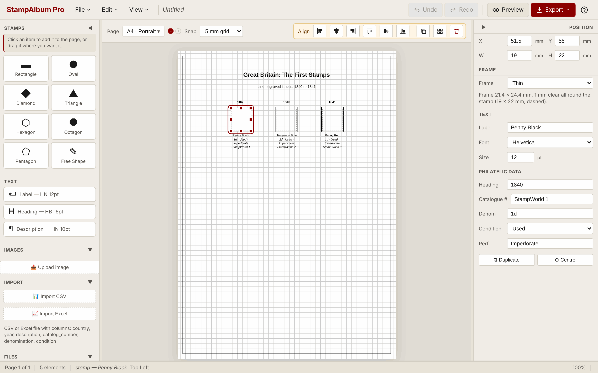
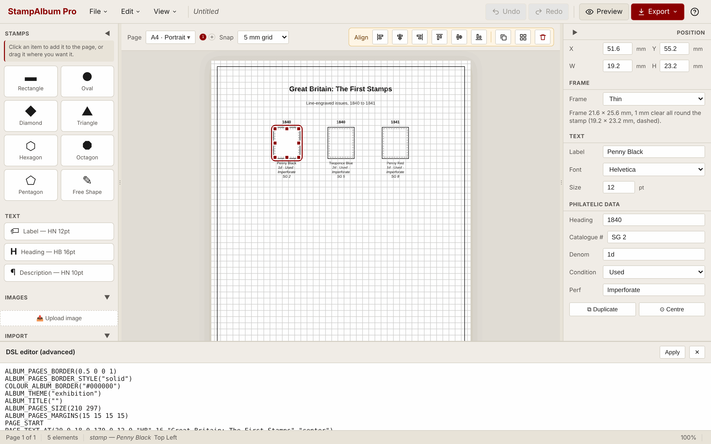

# StampAlbum Pro

Design and print stamp album pages. StampAlbum Pro pairs a drag-and-drop page canvas with a text-based page description (DSL) and exports print-ready pages.

> **Status: alpha (v0.2.0).** Developed on macOS. The automated test suite also runs on Windows and Linux in CI. There are no packaged installers yet, so run it from source (see below).



## What it does today

- **Visual canvas:** place, drag, resize and align stamps and text elements on a page
- **Stamp shapes:** rectangle, triangle, diamond, oval, hexagon, octagon, pentagon
- **Stamp frames:** None, Thin, Medium or Double, always black. You enter the stamp's own size from the catalogue; the frame is drawn 1 mm clear all round it
- **Captions:** a heading above each stamp; description, details and catalogue number below
- **Themes and page borders:** plain borders for exhibition pages and decorative ones (corner ornaments, Greek key, Rope) for personal albums, in the theme's colour
- **Pages:** add and delete pages; page sizes include A5 and Legal
- **Layout tools:** grid fill and undo/redo
- **Images:** upload and place images on a page
- **Starter templates:** four `.slbum` albums in `templates/` (one-column quadrille, compact two-column, Europe two-column, worldwide three-column). These use the legacy row-based layout and currently export with layout problems (see the changelog)
- **DSL mode:** an advanced text view of the same page, for precise or bulk editing
- **Export:** PDF, PNG and SVG
- **Album files:** create, open, save and delete `.slbum` albums from the sidebar



The tutorial pictures and these screenshots are made from the running app with `make screenshots` (`tools/screenshots.py`); run it after changing how the editor looks.

## What it does not do yet

- **No exhibition-rule checking.** The goal is pages that meet international exhibition standards, but this release does not verify compliance with any federation's rules. Check your pages against the current regulations yourself.
- **No installers.** There is no signed macOS app or Windows installer yet. The PyInstaller specs in `packaging/` are out of date.

## Run from source

Requirements: Python 3.10 or newer (CI tests 3.10, 3.11 and 3.13) and [uv](https://docs.astral.sh/uv/).

```bash
git clone https://github.com/jsganesh/stamp-album-pro.git
cd stamp-album-pro
uv sync --extra dev

uv run stamp-album             # starts the app at http://127.0.0.1:8080 and opens your browser
uv run stamp-album --desktop   # the same app in a native window (pywebview)
```

Other modes: `--web` (browser mode, explicit), `--dev` (auto-reload while developing) and `--legacy-qt` (the old PyQt6 editor, needs the `legacy` extra).

Headless PDF generation from a DSL file: `uv run stamp-album -c album.slbum -o album.pdf`. Add `-p` to also write an HTML preview; `stamp-album --cli --help` lists every option.

Without uv: `python -m venv .venv`, activate it, then `pip install -e ".[dev]"`.

Platform notes:
- **macOS:** the main development platform.
- **Windows:** tests pass in CI; the app itself has not been checked there yet.
- **Linux:** tests pass in CI on Ubuntu; the app itself is not verified.

The `launcher/` folder contains launch scripts (a `.command` file for macOS, a `.bat` file for Windows, a `.desktop` file for Linux; see `launcher/README.md`). They have not been tested for 0.2.0.

## Development

```bash
make test                    # pytest on src/tests
uv run ruff check src        # lint (advisory: there is a known backlog)
```

CI runs the tests on macOS, Windows and Ubuntu from the locked dependencies in `uv.lock`. It also builds the wheel and checks that it contains the web UI, contains no test code, and imports in a clean environment.

## Project layout

```
src/stamp_album/
  api.py        FastAPI backend (albums, templates, export)
  core/         models, DSL parser, serializer
  engines/      layout and rendering (HTML preview, PDF, PNG, SVG)
  web/          browser UI (HTML, JS, CSS)
  ui/           legacy PyQt6 editor (optional, not maintained)
templates/      starter albums (.slbum)
assets/         sample album files
launcher/       launch scripts for macOS, Windows and Linux
packaging/      PyInstaller specs (known stale)
docs/           architecture and build notes
```

## Documentation

- [ARCHITECTURE.md](ARCHITECTURE.md): how the rendering pipeline fits together. Some sections predate the ReportLab engines.
- [docs/BUILD.md](docs/BUILD.md): packaging notes (out of date, being updated)
- [CHANGELOG.md](CHANGELOG.md): what changed in each release

## Licence

MIT, see [LICENSE](LICENSE).

Licensing note: dependency licences have not been audited yet, so review them before distributing binaries. (v0.2.0 included PyMuPDF, which is AGPL-3.0 or commercial; it has since been removed.)
